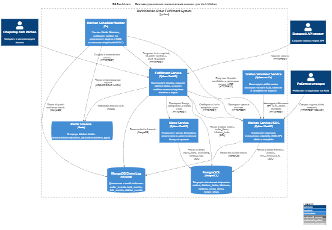
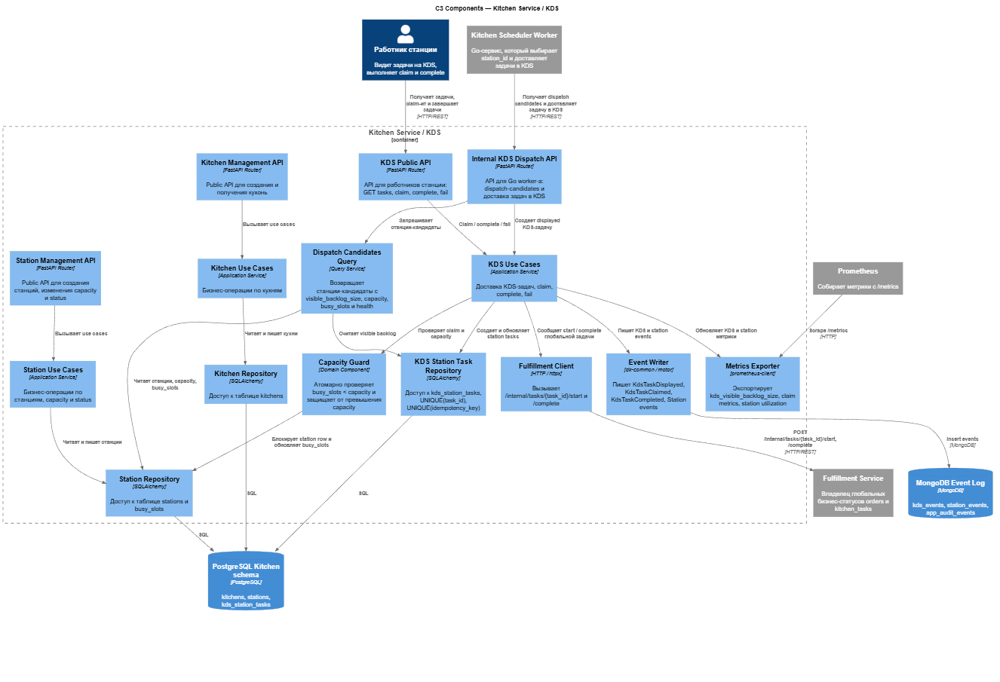

# Отчёт по практике №1

## Тема проекта

**Система управления выполнением заказов для dark kitchen с Redis Streams, Go-based scheduler worker и KDS-моделью станций**

Проект основан на ТЗ для микросервисной backend-системы dark kitchen, где заказы раскладываются на kitchen tasks, задачи публикуются в Redis Streams, Go-based Kitchen Scheduler Worker доставляет их в KDS, а Fulfillment Service остается владельцем глобальных бизнес-статусов заказов и задач. :contentReference[oaicite:0]{index=0}

---

## 1. Problem Statement

Система управления выполнением заказов для dark kitchen предназначена для операторов, внешних API-клиентов, работников кухонных станций и демонстрационного station-simulator. Система принимает заказы на конкретную кухню, проверяет доступность блюд, раскладывает заказ на kitchen tasks по рецептам, публикует задачи в Redis Streams и диспетчеризует их на конкретные станции через Kitchen Scheduler Worker на Go. Работники станции видят задачи в KDS, берут их в работу через `claim` и завершают через `complete`, после чего Fulfillment Service обновляет глобальные статусы задач и переводит заказ в `ready_for_pickup`. Система взаимодействует с PostgreSQL для хранения текущего состояния, Redis Streams для асинхронных очередей задач, MongoDB для event/audit log, а также с Prometheus и Grafana для метрик и мониторинга.

---

## 2. Диаграмма C1 — Context

### Скриншот диаграммы

### Ссылка на PlantUML-файл

[c1-context.puml](diagram_sources/context.puml)

### Анализ диаграммы

| Аспект | Что сгенерировал ИИ | Что исправлено вручную | Обоснование исправления |
|---|---|---|---|
| Границы системы | ИИ выделил систему как единый `Dark Kitchen Order Fulfillment System`. | Название системы уточнено как система управления выполнением заказов для dark kitchen. | Название должно отражать предметную область и соответствовать теме ТЗ. |
| Пользователи | ИИ добавил оператора, API-клиента, работника станции и DevOps/разработчика. | Уточнены роли пользователей: оператор создает кухни/станции/заказы, работник станции работает через KDS. | В C1 важно показать не технические детали, а внешних участников и их цели. |
| Внешние системы | ИИ добавил PostgreSQL, Redis Streams, MongoDB, Prometheus + Grafana. | Redis был уточнен именно как Redis Streams, а MongoDB — как event/audit log. | В ТЗ Redis используется не просто как cache, а как очередь задач; MongoDB не является основной БД, а хранит историю событий. |
| Связи | ИИ показал взаимодействия пользователей с системой и системы с инфраструктурой. | Убраны лишние внутренние микросервисные связи, так как C1 показывает только контекст системы. | На уровне C1 не нужно раскрывать контейнеры и внутреннюю архитектуру. |
| Назначение диаграммы | ИИ показал систему в окружении внешних акторов и инфраструктуры. | Добавлен заголовок `C1 Context`. | Заголовок нужен для читаемости отчёта и соответствия заданию. |

---

## 3. Диаграмма C2 — Containers

### Скриншот диаграммы

### Ссылка на PlantUML-файл

[c2-containers.puml](diagram_sources/containers.puml)

### Анализ диаграммы

| Аспект | Что сгенерировал ИИ | Что исправлено вручную | Обоснование исправления |
|---|---|---|---|
| Набор контейнеров | ИИ выделил Fulfillment Service, Kitchen Service / KDS, Menu Service, Kitchen Scheduler Worker и Station Simulator Service. | Состав контейнеров приведен к deployable-сервисам из ТЗ. | В C2 должны быть показаны именно запускаемые сервисы, а не отдельные классы или модули. |
| Kitchen Scheduler Worker | ИИ сначала мог представить worker как компонент, выполняющий приготовление. | Уточнено, что worker только читает Redis Streams, выбирает `station_id`, доставляет задачу в KDS и вызывает `mark-displayed`. | По ТЗ worker не готовит задачу, не делает `sleep(time_to_cook)` и не переводит задачи в `in_progress` / `done`. |
| Fulfillment Service | ИИ показал Fulfillment как сервис заказов. | Уточнено, что Fulfillment является единственным владельцем глобальных статусов `orders` и `kitchen_tasks`. | Это ключевое архитектурное ограничение: Kitchen Service и Go worker не должны напрямую менять глобальные бизнес-статусы задач. |
| Kitchen Service / KDS | ИИ показал Kitchen Service как сервис кухонь. | Добавлено, что внутри него находится KDS API, claim/complete и контроль capacity. | В ТЗ KDS реализуется внутри Kitchen Service, поэтому это нужно явно показать на уровне контейнеров. |
| Хранилища | ИИ добавил PostgreSQL, MongoDB и Redis. | PostgreSQL описан как транзакционное состояние, MongoDB как event log, Redis Streams как очередь kitchen tasks. | У каждого хранилища в системе своя роль, и их нельзя смешивать. |
| Мониторинг | ИИ добавил Prometheus и Grafana. | Уточнено, что Prometheus собирает `/metrics`, а Grafana отображает dashboards. | Это соответствует требованиям наблюдаемости MVP. |
| Межсервисные связи | ИИ сгенерировал базовые HTTP-связи между сервисами. | Добавлены ключевые потоки: Fulfillment → Redis, Worker → Kitchen/KDS, Kitchen/KDS → Fulfillment. | Эти связи отражают основной бизнес-процесс `order → Redis → Worker → KDS → claim → complete → ready_for_pickup`. |

---

## 4. Диаграмма C3 — Components для Kitchen Service / KDS

### Скриншот диаграммы

### Ссылка на PlantUML-файл

[c3-kitchen-service-kds.puml](diagram_sources/c3-kitchen-service-kds.puml)

### Почему выбран Kitchen Service / KDS

Для диаграммы C3 выбран контейнер **Kitchen Service / KDS**, потому что он содержит ключевую внутреннюю логику работы станций: отображение задач в KDS, доставку задач от scheduler worker-а, `claim`, `complete`, контроль `busy_slots < capacity`, локальные KDS-статусы и запись KDS/station events.

### Анализ диаграммы

| Аспект | Что сгенерировал ИИ | Что исправлено вручную | Обоснование исправления |
|---|---|---|---|
| Выбор контейнера | ИИ предложил рассмотреть внутреннюю структуру одного ключевого контейнера. | Для C3 выбран `Kitchen Service / KDS`. | Этот контейнер наиболее важен для демонстрации внутренней логики KDS, capacity, claim и complete. |
| API-компоненты | ИИ выделил публичные и внутренние API. | Компоненты разделены на `Kitchen Management API`, `Station Management API`, `KDS Public API` и `Internal KDS Dispatch API`. | Такое разделение показывает разные группы пользователей: оператор, работник станции и Go worker. |
| KDS-логика | ИИ сгенерировал общий компонент KDS. | Добавлены `KDS Use Cases`, `Capacity Guard` и `Dispatch Candidates Query`. | Эти компоненты отражают реальные инварианты: не допустить двойной claim, не превысить capacity и выбрать станции-кандидаты для dispatch. |
| Репозитории | ИИ мог показать одну общую БД без детализации. | Добавлены отдельные репозитории: `Kitchen Repository`, `Station Repository`, `KDS Station Task Repository`. | В C3 полезно показать, какие части сервиса работают с `kitchens`, `stations` и `kds_station_tasks`. |
| Взаимодействие с Fulfillment | ИИ связал Kitchen Service с Fulfillment Service. | Уточнено, что Kitchen Service вызывает Fulfillment только для `/start` и `/complete`. | Kitchen Service не является владельцем глобального статуса задачи, поэтому он сообщает Fulfillment о событиях, а не меняет `kitchen_tasks` напрямую. |
| Идемпотентность | ИИ мог не отразить повторную доставку задач. | В диаграмме добавлен `KDS Station Task Repository` с уникальностью `task_id` и `idempotency_key`. | Это нужно, чтобы повторный dispatch не создавал дубликаты KDS-задач. |
| События и метрики | ИИ добавил MongoDB и Prometheus. | Уточнено, что `Event Writer` пишет KDS/station events, а `Metrics Exporter` отдает KDS и station metrics. | Это соответствует требованиям наблюдаемости: бизнес-события идут в MongoDB, метрики — в Prometheus. |
| Легенда и заголовок | ИИ сгенерировал диаграмму без поясняющих элементов. | Добавлены `title` и `LAYOUT_WITH_LEGEND()`, а также отдельная легенда. | По заданию для C3 нужно добавить заголовок и легенду диаграммы. |

---

## 5. Используемые файлы

| Файл | Назначение |
|---|---|
| `diagram_sourcres/c1-context.puml` | PlantUML-код диаграммы C1 Context |
| `diagram_sourcres/c2-containers.puml` | PlantUML-код диаграммы C2 Containers |
| `diagram_sourcres/c3-kitchen-service-kds.puml` | PlantUML-код диаграммы C3 Components |
| `img/c1-context.png` | Скриншот или экспорт C1-диаграммы |
| `img/c2-containers.png` | Скриншот или экспорт C2-диаграммы |
| `img/c3-kitchen-service-kds.png` | Скриншот или экспорт C3-диаграммы |

---

## 6. Вывод

В ходе практической работы был сформулирован Problem Statement для системы управления выполнением заказов dark kitchen и построены три диаграммы C4: Context, Container и Component. Диаграмма C1 показывает систему во внешнем окружении, C2 раскрывает микросервисную структуру и основные контейнеры, а C3 детализирует внутреннее устройство Kitchen Service / KDS. После генерации диаграммы были вручную уточнены с учетом ТЗ: разделены ответственности Fulfillment Service, Kitchen Service и Go-based Scheduler Worker, добавлены Redis Streams, MongoDB event log, Prometheus/Grafana и ограничения по KDS claim, capacity и идемпотентной доставке задач.