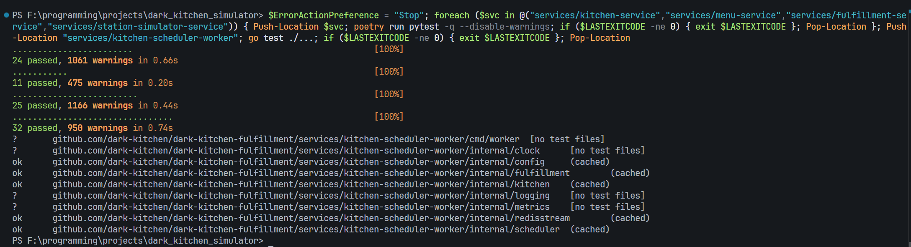
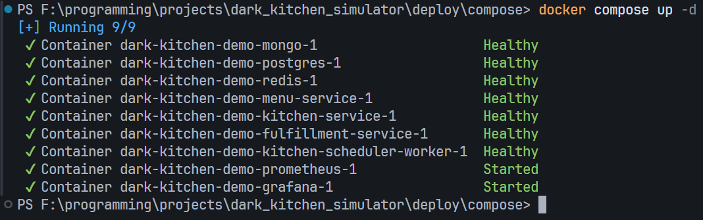
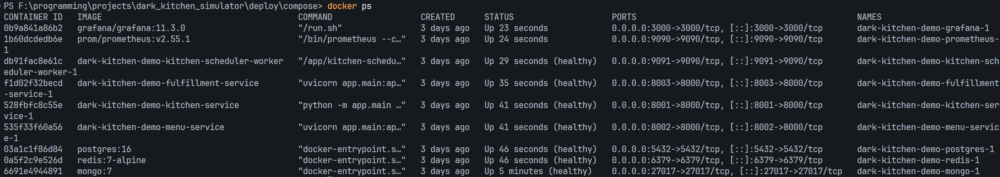
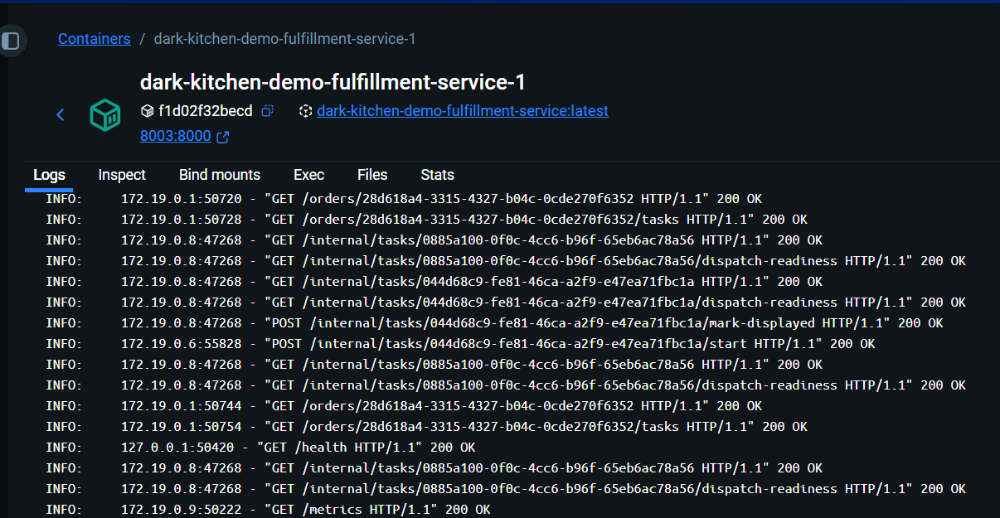
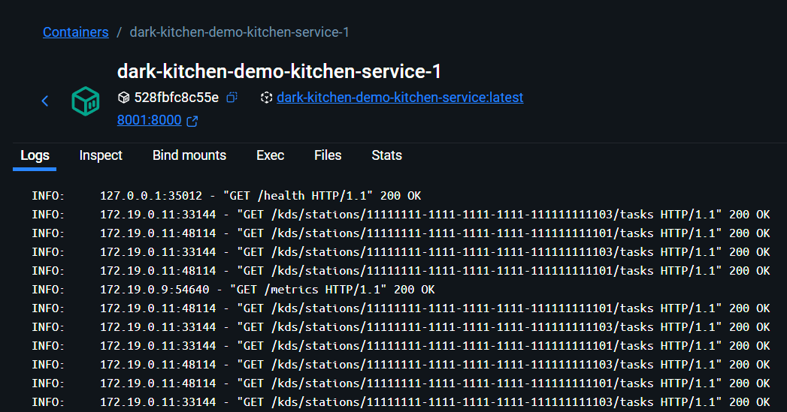
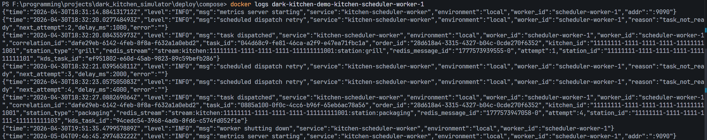

# Practice 2: Dark Kitchen Simulator

## Репозиторий

Ссылка на репозиторий: <https://github.com/MartyrMind/dark_kitchen_simulator>

## Использованные ИИ-инструменты

- OpenAI ChatGPT / Codex - генерация и доработка кода сервисов, тестов, Dockerfile и docker-compose конфигурации.


## Примеры наиболее полезных промптов

```text
Сгенерируй структуру микросервисного backend-проекта для dark kitchen:
Fulfillment Service, Kitchen Service, Menu Service, Go Kitchen Scheduler Worker,
Station Simulator Service. У каждого сервиса должна быть своя зона ответственности,
свой pyproject.toml или go.mod, Dockerfile и healthcheck.
```

```text
Реализуй бизнес-flow:
POST /orders -> Fulfillment создает order и kitchen_tasks -> публикует задачи
в Redis Streams -> Go worker читает stream -> доставляет task в Kitchen KDS ->
Fulfillment переводит task queued -> displayed.
Не нарушай границы сервисов и не пиши напрямую в чужие таблицы.
```

```text
Добавь unit/component tests для Python-сервисов и go test для kitchen-scheduler-worker.
Тесты должны проверять статусные переходы, KDS claim/complete и dispatch retry.
```

```text
Собери docker-compose для локального демо:
PostgreSQL, Redis, MongoDB, menu-service, kitchen-service, fulfillment-service,
kitchen-scheduler-worker, prometheus, grafana. Добавь healthcheck и проброс портов.
```

## Оценка доли кода

Оценочно:

- около 70% кода было написано или первоначально сгенерировано ИИ;
- около 30% кода было написано, исправлено и проверено вручную.

Ручная часть включала проверку архитектурных границ, исправление ошибок интеграции, настройку Docker Compose, правку тестов, запуск сервисов и анализ логов.

## Ошибки и способы исправления

Основные проблемы, которые возникали во время разработки:

- ИИ иногда предлагал прямые импорты Python-кода между сервисами. Исправление: общие технические вещи вынесены только в `libs/python/dk-common`, а доменная логика осталась внутри сервисов.
- ИИ пытался сделать единый root `pyproject.toml` для всех Python-сервисов. Исправление: у каждого Python-сервиса оставлен собственный `pyproject.toml`, а общая библиотека подключена как path dependency.
- В ранних вариантах worker мог выполнять лишнюю бизнес-логику, например переводить task в `in_progress` или `done`. Исправление: Go worker оставлен только как dispatcher: Redis Streams -> Fulfillment readiness -> Kitchen KDS -> Fulfillment mark-displayed -> XACK.
- Были ошибки в URL и портах между контейнерами: внутри Compose нужно использовать service DNS names, например `kitchen-service:8000`, а не localhost. Исправление: переменные окружения в `deploy/compose/docker-compose.yml` настроены на внутренние имена сервисов.
- Возникали проблемы с порядком запуска сервисов. Исправление: добавлены `healthcheck` и `depends_on` с ожиданием healthy-состояния для Postgres, Redis, MongoDB и backend-сервисов.
- ИИ иногда смешивал MongoDB audit events и application logs. Исправление: MongoDB оставлена для бизнес/audit событий, а application logs пишутся в stdout/stderr контейнеров.

## Схема взаимодействия микросервисов

```text
Client
  |
  | POST /orders
  v
Fulfillment Service
  | - создает orders, order_items, kitchen_tasks
  | - проверяет menu/recipe через Menu Service
  | - публикует tasks в Redis Streams
  v
Redis Streams
  |
  v
Kitchen Scheduler Worker (Go)
  | - читает stream
  | - спрашивает Fulfillment snapshot/readiness
  | - выбирает station_id через Kitchen dispatch candidates
  | - доставляет task в KDS
  | - вызывает Fulfillment mark-displayed
  v
Kitchen Service
  | - хранит stations, capacity, busy_slots, kds_station_tasks
  | - предоставляет KDS API
  v
Station Simulator Service
  | GET /kds/stations/{station_id}/tasks
  | POST /claim
  | POST /complete
  v
Kitchen Service
  | - при claim вызывает Fulfillment start
  | - при complete вызывает Fulfillment complete
  v
Fulfillment Service
  | - переводит task в in_progress/done
  | - когда все tasks done, переводит order в ready_for_pickup
  v
MongoDB audit events + Prometheus metrics
```

## Скриншот успешного прохождения автотестов

Команда запуска тестов сохранена в [test_run_command.md](test_run_command.md).



## Скриншоты docker-compose up и работающих сервисов

Запуск `docker compose up -d`: все 9 контейнеров запущены, основные backend-сервисы healthy.



Список работающих контейнеров через `docker ps`.



## Скриншоты логов сервисов

Fulfillment Service: видны HTTP-запросы к order/task endpoint'ам, переходы task и обращение к `/metrics`.



Kitchen Service: видны healthcheck, запросы KDS station tasks и Prometheus `/metrics`.



Kitchen Scheduler Worker: видны запуск metrics server, retry dispatch и успешные сообщения `task dispatched`.


