# Практика 3: Kubernetes / Minikube

Отчет по развертыванию dark kitchen системы в Minikube. Основные Kubernetes-манифесты находятся в `deploy/k8s`, основной overlay для локального запуска: `deploy/k8s/overlays/minikube`.

## 1. Список микросервисов и образов

Прикладные микросервисы:

| Микросервис | Kubernetes workload | Service | Docker image |
| --- | --- | --- | --- |
| kitchen-service | Deployment/kitchen-service | svc/kitchen-service:8000 | dark-kitchen/kitchen-service:local |
| menu-service | Deployment/menu-service | svc/menu-service:8000 | dark-kitchen/menu-service:local |
| fulfillment-service | Deployment/fulfillment-service | svc/fulfillment-service:8000 | dark-kitchen/fulfillment-service:local |
| kitchen-scheduler-worker | Deployment/kitchen-scheduler-worker | svc/kitchen-scheduler-worker:9090 | dark-kitchen/kitchen-scheduler-worker:local |
| station-simulator-service | Deployment/station-simulator-service | svc/station-simulator-service:8000 | dark-kitchen/station-simulator-service:local |

Инфраструктурные компоненты:

| Компонент | Kubernetes workload | Service | Docker image |
| --- | --- | --- | --- |
| PostgreSQL | StatefulSet/postgres | svc/postgres:5432 | postgres:16 |
| Redis | StatefulSet/redis | svc/redis:6379 | redis:7 |
| MongoDB | StatefulSet/mongo | svc/mongo:27017 | mongo:7 |
| Prometheus | Deployment/prometheus | svc/prometheus:9090 | prom/prometheus:v2.55.1 |
| Grafana | Deployment/grafana | svc/grafana:3000 | grafana/grafana:11.3.0 |

Команда для получения списка workload'ов и образов из кластера:

```bash
kubectl -n dark-kitchen get deploy,statefulset \
  -o custom-columns=KIND:.kind,NAME:.metadata.name,IMAGE:.spec.template.spec.containers[*].image
```

Подтверждение:

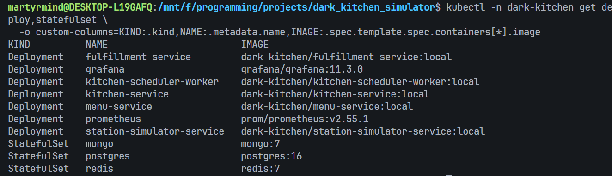

## 2. Инструкция по развертыванию в Minikube

Шаги выполнялись из корня репозитория:

```bash
cd /mnt/f/programming/projects/dark_kitchen_simulator
```

Запуск Minikube и Ingress:

```bash
minikube start
minikube addons enable ingress
```

Сборка и загрузка локальных образов в Minikube:

```bash
chmod +x scripts/k8s/*.sh
./scripts/k8s/minikube-build-images.sh
```

Применение Kubernetes-манифестов:

```bash
kubectl apply -k deploy/k8s/overlays/minikube
```

Ожидание готовности основных workload'ов:

```bash
kubectl -n dark-kitchen rollout status statefulset/postgres
kubectl -n dark-kitchen rollout status statefulset/redis
kubectl -n dark-kitchen rollout status statefulset/mongo
kubectl -n dark-kitchen rollout status deploy/kitchen-service
kubectl -n dark-kitchen rollout status deploy/menu-service
kubectl -n dark-kitchen rollout status deploy/fulfillment-service
kubectl -n dark-kitchen rollout status deploy/kitchen-scheduler-worker
kubectl -n dark-kitchen rollout status deploy/station-simulator-service
```

Применение миграций БД:

```bash
./scripts/k8s/run-migrations.sh
```

Проверка ресурсов:

```bash
kubectl -n dark-kitchen get pods
kubectl -n dark-kitchen get svc
kubectl -n dark-kitchen get ingress
```

Для локальной проверки сервисов использовался `port-forward`, например:

```bash
kubectl -n dark-kitchen port-forward svc/kitchen-service 8001:8000
```

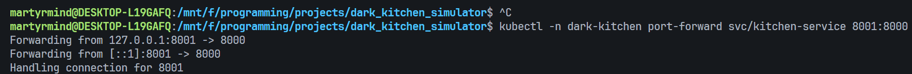

Пример проверки health endpoint:

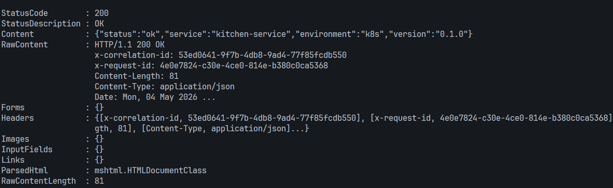

## 3. Скриншоты

### 3.1. kubectl get pods, svc, ingress

Pod'ы приложения и инфраструктуры запущены:

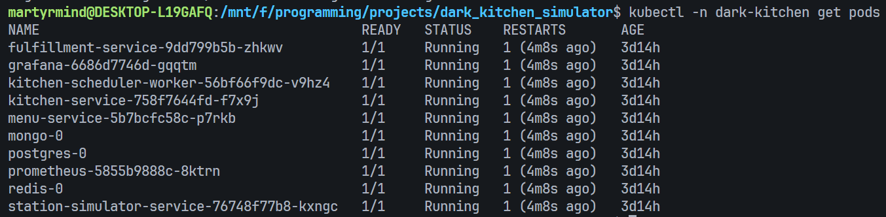

Сервисы созданы и доступны внутри кластера:

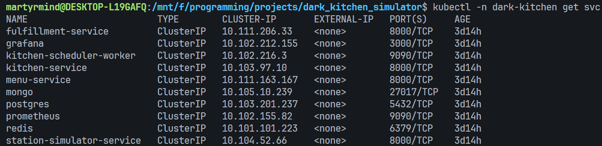

Ingress создан для хоста `dark-kitchen.local`:

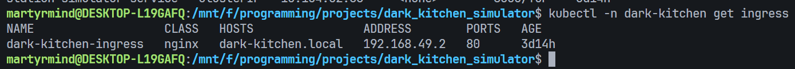

### 3.2. Успешный curl-запрос через Ingress

В WSL для стабильной проверки Ingress использовался port-forward сервиса `ingress-nginx-controller` на локальный порт `8080`:

```bash
kubectl -n ingress-nginx port-forward svc/ingress-nginx-controller 8080:80
```

Запросы выполнялись с заголовком `Host: dark-kitchen.local`, чтобы сработало правило Ingress:

```bash
curl --max-time 10 -i \
  -H "Host: dark-kitchen.local" \
  http://127.0.0.1:8080/kitchens

curl --max-time 10 -i \
  -H "Host: dark-kitchen.local" \
  "http://127.0.0.1:8080/menu-items?limit=5"
```

Оба запроса вернули `HTTP/1.1 200 OK` и JSON-ответы приложения:

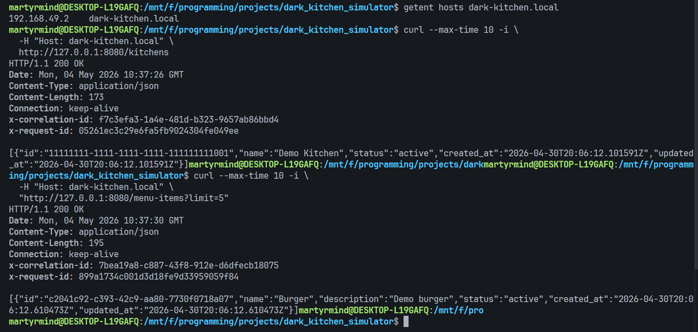

### 3.3. Логи одного из подов

Для отчета были сняты логи `fulfillment-service`:

```bash
kubectl -n dark-kitchen logs deploy/fulfillment-service --tail=100
```

На скриншоте видно, что после включения Linkerd у pod'а есть sidecar/proxy-контейнеры, а логи доступны через стандартный `kubectl logs`.

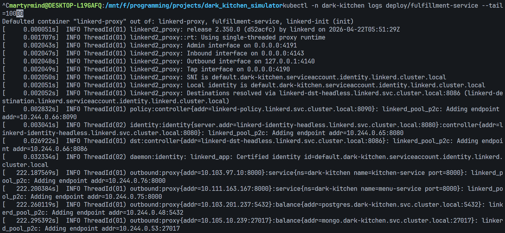

### 3.4. Демонстрационный сценарий

Для проверки полного business-flow был запущен smoke demo:

```powershell
poetry -C services/kitchen-service run python ../../scripts/demo/smoke_demo.py `
  --fulfillment-url http://localhost:8003 `
  --kitchen-url http://localhost:8001 `
  --prometheus-url http://localhost:9090 `
  --grafana-url http://localhost:3000 `
  --state-file ../../scripts/demo/.demo_state.json `
  --timeout 180
```

Результат: заказ успешно дошел до статуса `ready_for_pickup`.

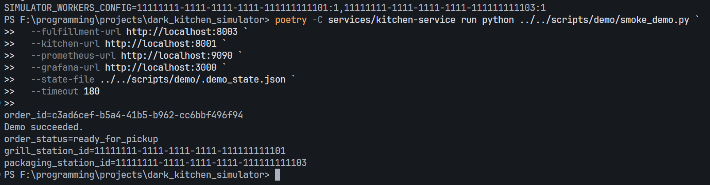

## 4. Дополнительные усложнения

### 4.1. StatefulSet

В проекте stateful-компоненты развернуты как StatefulSet с постоянным хранилищем через `volumeClaimTemplates`:

| Компонент | Манифест |
| --- | --- |
| PostgreSQL | `deploy/k8s/base/postgres/statefulset.yaml` |
| Redis | `deploy/k8s/base/redis/statefulset.yaml` |
| MongoDB | `deploy/k8s/base/mongo/statefulset.yaml` |

Эти манифесты входят в основной `deploy/k8s/base/kustomization.yaml` и применяются через overlay `deploy/k8s/overlays/minikube`.

### 4.2. HPA

HPA-манифесты находятся в:

```text
deploy/k8s/base/hpa
```

Применение:

```bash
minikube addons enable metrics-server
kubectl apply -k deploy/k8s/base/hpa
kubectl -n dark-kitchen get hpa
```

Созданные HPA:

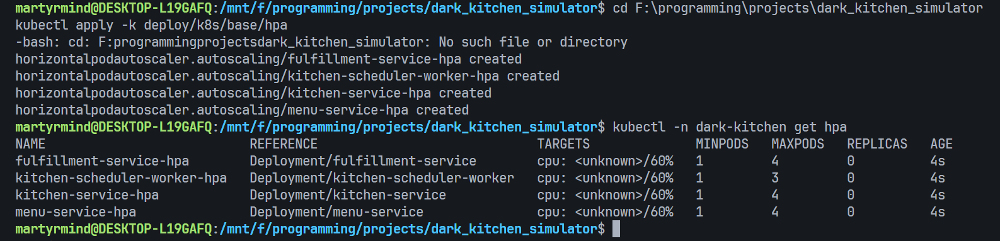

Описание `fulfillment-service-hpa`: target CPU utilization равен 60%, minReplicas=1, maxReplicas=4.

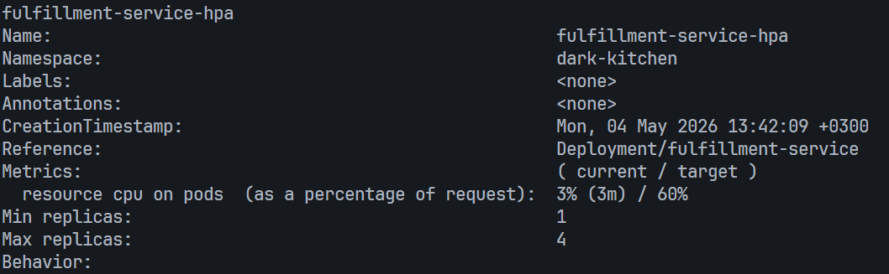

Для нагрузки использовался скрипт:

```bash
./scripts/k8s/load-test-hpa.sh
```

Скрипт запускает pod с `fortio/fortio` внутри namespace `dark-kitchen` и генерирует запросы к `http://fulfillment-service:8000/health`.

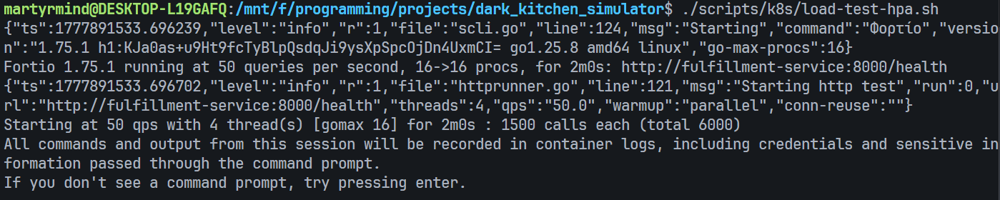

Во время нагрузки наблюдался рост CPU utilization в HPA targets:

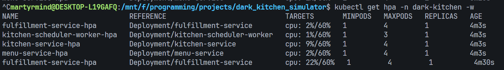

### 4.3. Service Mesh

В качестве service mesh используется Linkerd. Манифесты/overlay:

```text
deploy/k8s/overlays/minikube-linkerd
deploy/k8s/base/service-mesh
```

Linkerd установлен вместе с Linkerd Viz. Подтверждение, что control plane и viz-компоненты запущены:

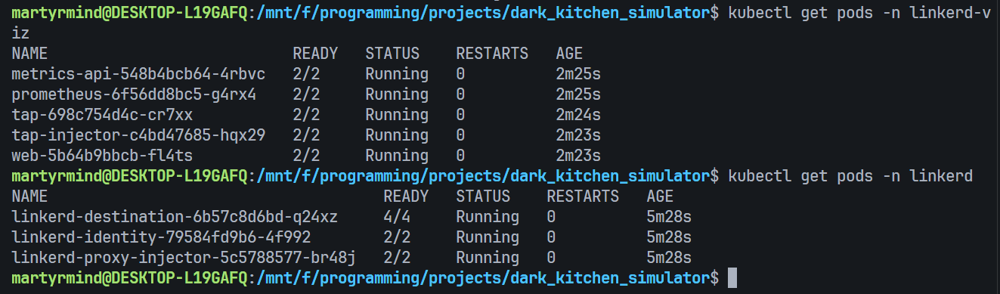

Sidecar injection включен для прикладных Deployment:

```text
kitchen-service
menu-service
fulfillment-service
kitchen-scheduler-worker
station-simulator-service
```

Инфраструктурные компоненты PostgreSQL, Redis, MongoDB, Prometheus и Grafana не инжектируются.

Наличие контейнера `linkerd-proxy` в pod'ах прикладных сервисов:

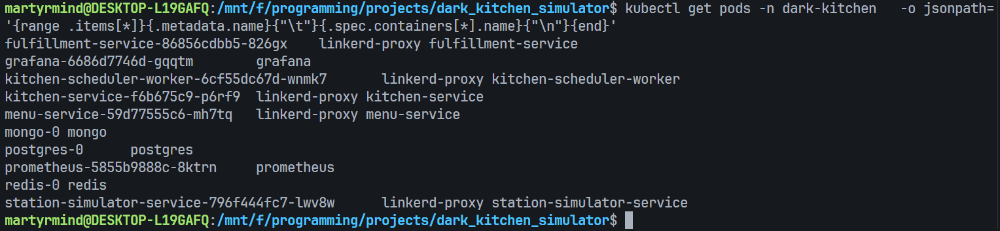

Статистика трафика через Linkerd Viz:

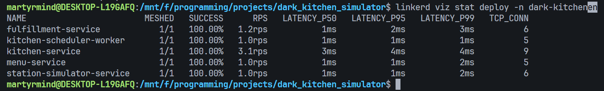

Dashboard Linkerd Viz показывает namespace `dark-kitchen`, количество meshed workload'ов, success rate, RPS и latency:

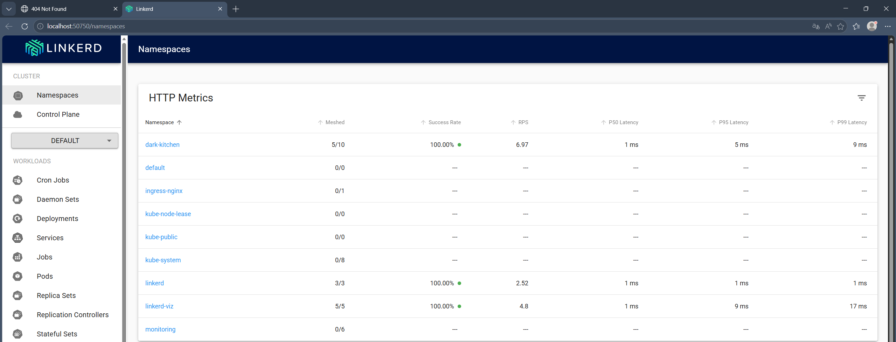

## 5. Вывод

Система успешно развернута в Minikube. Созданы Deployment для микросервисов, StatefulSet для PostgreSQL, Redis и MongoDB, Services, Ingress, ConfigMap и Secret. Приложение отвечает через Ingress, demo flow завершается статусом `ready_for_pickup`. Дополнительно продемонстрированы HPA и Linkerd service mesh.
