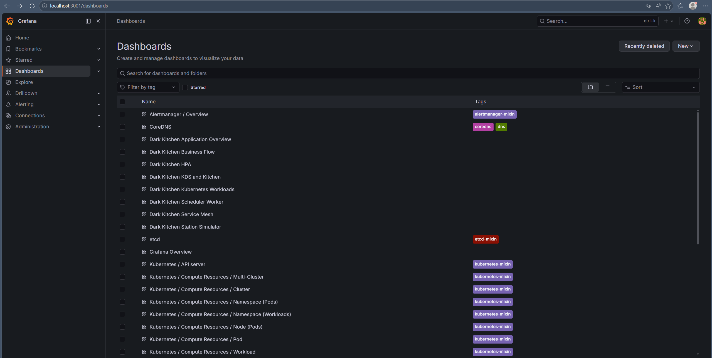
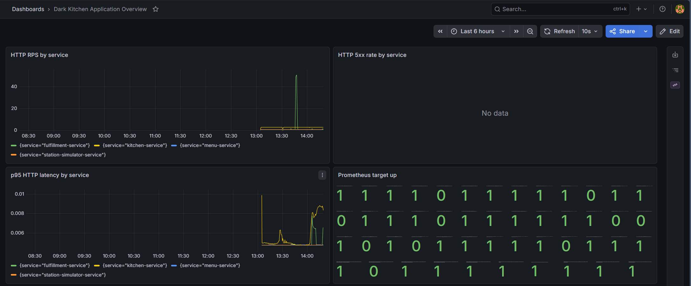
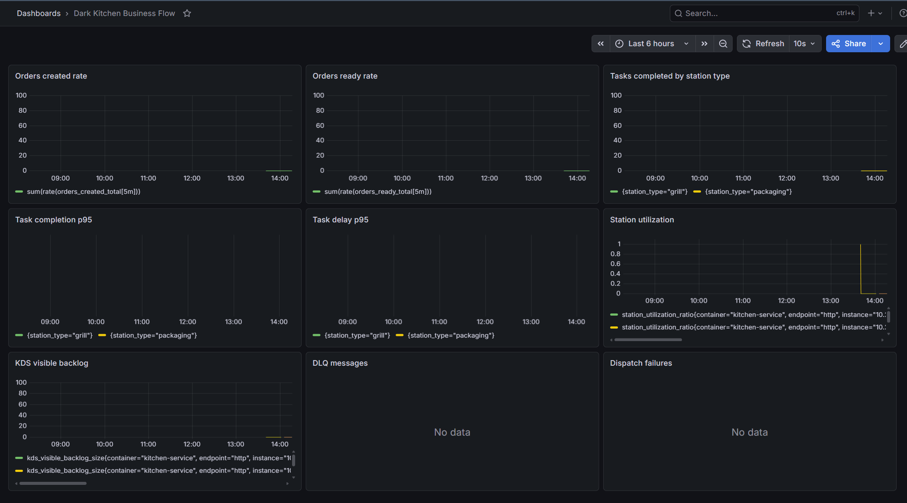
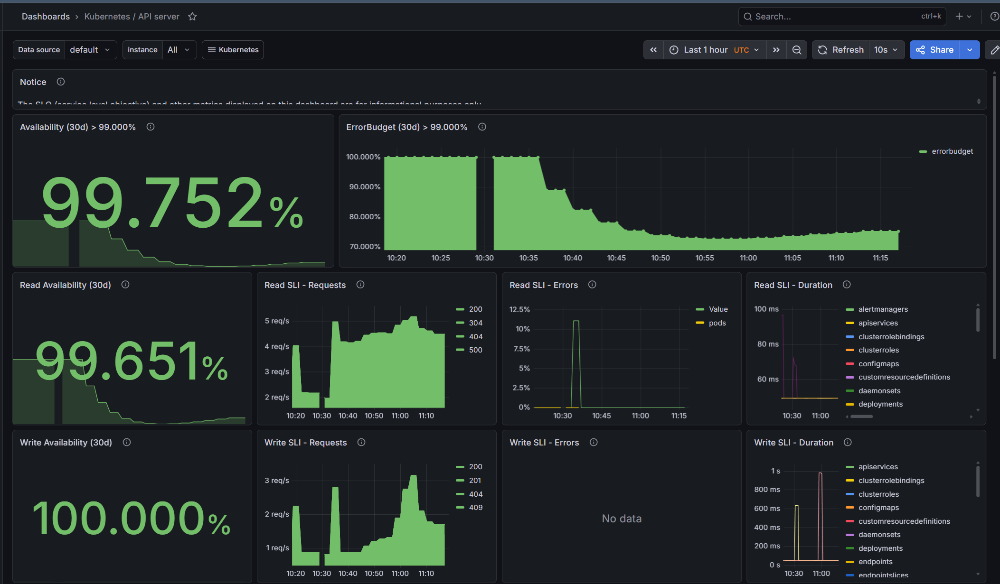

# Практика 4. Мониторинг микросервисной системы Dark Kitchen

## Выбранная система мониторинга

Для мониторинга выбрана связка **Prometheus + Grafana**, установленная в Kubernetes через `kube-prometheus-stack`.

Почему выбран этот вариант:

- Prometheus хорошо подходит для микросервисов: каждый сервис экспортирует метрики на `/metrics`, а Prometheus регулярно собирает их pull-моделью.
- `kube-prometheus-stack` сразу дает Prometheus Operator, Grafana, kube-state-metrics и node-exporter, поэтому можно наблюдать и приложение, и Kubernetes-инфраструктуру.
- Grafana позволяет собрать отдельные dashboards для технических метрик, бизнес-flow, KDS, scheduler worker, HPA и Kubernetes API server.
- Для учебного dark kitchen проекта Prometheus-метрики достаточно прозрачны: по ним видно RPS, ошибки, latency, очередь задач, загрузку станций и успешность dispatch-процесса.

## Экспортируемые метрики приложения

Все HTTP-сервисы публикуют endpoint `/metrics` в Prometheus-формате.

### Общие HTTP-метрики

| Метрика | Тип | Labels | Зачем нужна |
|---|---|---|---|
| `http_requests_total` | Counter | `service`, `method`, `path`, `status` | Показывает количество HTTP-запросов. Через `rate(...)` используется для расчета RPS по каждому сервису и доли ошибок. |
| `http_request_duration_seconds` | Histogram | `service`, `method`, `path` | Показывает распределение длительности HTTP-запросов. Через `histogram_quantile(0.95, ...)` используется для p95 latency. |

### Fulfillment Service

| Метрика | Тип | Labels | Зачем нужна |
|---|---|---|---|
| `orders_created_total` | Counter | `kitchen_id` | Скорость создания заказов. Помогает видеть входящую бизнес-нагрузку. |
| `orders_ready_total` | Counter | `kitchen_id` | Скорость перехода заказов в `ready_for_pickup`. Показывает пропускную способность полного fulfillment-flow. |
| `orders_cancelled_total` | Counter | `kitchen_id` | Количество отмененных заказов. Нужна для контроля проблемных сценариев. |
| `orders_handed_off_total` | Counter | `kitchen_id` | Количество выданных заказов. Помогает отличать готовность от фактической передачи. |
| `orders_delayed_total` | Counter | `kitchen_id` | Количество задержанных заказов. Полезна для SLA-контроля. |
| `tasks_queued_total` | Counter | `kitchen_id`, `station_type` | Сколько kitchen tasks поставлено в Redis Streams. |
| `tasks_displayed_total` | Counter | `kitchen_id`, `station_type` | Сколько задач доставлено в KDS. Показывает, что worker смог выполнить dispatch. |
| `tasks_started_total` | Counter | `kitchen_id`, `station_type` | Сколько задач перешло в `in_progress`. Отражает активность станций. |
| `tasks_completed_total` | Counter | `kitchen_id`, `station_type` | Сколько задач завершено по типам станций. |
| `tasks_failed_total` | Counter | `kitchen_id`, `station_type` | Сколько задач завершилось ошибкой. |
| `task_actual_duration_seconds` | Histogram | `kitchen_id`, `station_type` | Фактическая длительность выполнения задачи. Используется для p95 completion time. |
| `task_delay_seconds` | Histogram | `kitchen_id`, `station_type` | Задержка относительно ожидаемого времени/SLA. Показывает деградацию при очередях или перегрузе станций. |

### Kitchen Service / KDS

| Метрика | Тип | Labels | Зачем нужна |
|---|---|---|---|
| `kds_visible_backlog_size` | Gauge | `kitchen_id`, `station_id`, `station_type` | Размер видимой очереди задач на KDS-станции. Помогает находить накопление backlog. |
| `kds_claim_attempts_total` | Counter | `kitchen_id`, `station_id`, `station_type` | Количество попыток взять задачу в работу. |
| `kds_claim_success_total` | Counter | `kitchen_id`, `station_id`, `station_type` | Успешные claim-операции. |
| `kds_claim_conflicts_total` | Counter | `kitchen_id`, `station_id`, `station_type`, `reason` | Конфликты при claim, например превышение capacity или уже занятая задача. |
| `station_busy_slots` | Gauge | `kitchen_id`, `station_id`, `station_type` | Сколько слотов станции занято сейчас. |
| `station_capacity` | Gauge | `kitchen_id`, `station_id`, `station_type` | Настроенная capacity станции. |
| `station_utilization_ratio` | Gauge | `kitchen_id`, `station_id`, `station_type` | Доля занятых слотов. По ней видно, какая станция становится bottleneck. |

### Kitchen Scheduler Worker

| Метрика | Тип | Labels | Зачем нужна |
|---|---|---|---|
| `dispatch_attempts_total` | Counter | `kitchen_id`, `station_type` | Количество попыток dispatch из Redis Streams в KDS. |
| `dispatch_success_total` | Counter | `kitchen_id`, `station_type`, `station_id` | Успешные dispatch-операции. |
| `dispatch_failed_total` | Counter | `kitchen_id`, `station_type`, `reason` | Ошибки dispatch. Позволяет видеть недоступность Kitchen/Fulfillment или отсутствие подходящей станции. |
| `dispatch_retries_total` | Counter | `kitchen_id`, `station_type`, `reason` | Запланированные retry после неуспешного dispatch. |
| `dispatch_latency_seconds` | Histogram | `kitchen_id`, `station_type` | Время dispatch. Помогает оценивать задержку между очередью Redis и появлением задачи в KDS. |
| `redis_pending_messages` | Gauge | `kitchen_id`, `station_type` | Текущие pending-сообщения Redis Streams. |
| `redis_dlq_messages_total` | Counter | `kitchen_id`, `station_type` | Сообщения, отправленные в DLQ после исчерпания retry. |

### Station Simulator Service

| Метрика | Тип | Labels | Зачем нужна |
|---|---|---|---|
| `simulator_claim_attempts_total` | Counter | `station_id`, `worker_id` | Попытки demo-worker взять KDS task. |
| `simulator_claim_success_total` | Counter | `station_id`, `worker_id` | Успешные claim-операции simulator worker. |
| `simulator_claim_conflicts_total` | Counter | `station_id`, `worker_id`, `reason` | Конфликты claim со стороны simulator worker. |
| `simulator_completed_tasks_total` | Counter | `station_id`, `worker_id` | Завершенные simulator worker задачи. |
| `simulator_task_duration_seconds` | Histogram | `station_id`, `worker_id` | Имитационная длительность выполнения задач. |
| `simulator_poll_errors_total` | Counter | `station_id`, `worker_id`, `reason` | Ошибки polling KDS API. |
| `simulator_active_workers` | Gauge | - | Количество активных demo-workers. |

## Как настроен сбор метрик

Мониторинг разворачивается через `kube-prometheus-stack`.

Основные настройки:

- Grafana включена в Helm values, пароль администратора для локального стенда: `admin`.
- Grafana sidecar автоматически подхватывает dashboards из ConfigMap с label `grafana_dashboard: "1"`.
- Prometheus настроен так, чтобы выбирать ServiceMonitor не только из Helm chart values: `serviceMonitorSelectorNilUsesHelmValues: false`.
- Включены `kube-state-metrics` и `prometheus-node-exporter`.
- Retention Prometheus для учебного стенда: `3d`.

Для приложений используются `ServiceMonitor`-ресурсы:

- `servicemonitor-fulfillment-service.yaml`
- `servicemonitor-kitchen-service.yaml`
- `servicemonitor-menu-service.yaml`
- `servicemonitor-kitchen-scheduler-worker.yaml`
- `servicemonitor-station-simulator-service.yaml`

Каждый `ServiceMonitor` выбирает Kubernetes Service по label `app: ...`, ходит на port `http`, path `/metrics`, interval `5s`, namespace `dark-kitchen`.

## Скриншоты dashboards

### Список dashboards



На скриншоте видно, что в Grafana загружены как стандартные Kubernetes dashboards, так и пользовательские dashboards проекта:

- `Dark Kitchen Application Overview`
- `Dark Kitchen Business Flow`
- `Dark Kitchen HPA`
- `Dark Kitchen KDS and Kitchen`
- `Dark Kitchen Kubernetes Workloads`
- `Dark Kitchen Scheduler Worker`
- `Dark Kitchen Service Mesh`
- `Dark Kitchen Station Simulator`

### Dark Kitchen Application Overview



Панели:

- **HTTP RPS by service**: показывает входящий RPS по каждому сервису через `sum by (service) (rate(http_requests_total[1m]))`. На графике виден резкий всплеск нагрузки на `fulfillment-service` примерно до 50 RPS и небольшой постоянный поток запросов к `kitchen-service`.
- **HTTP 5xx rate by service**: показывает rate серверных ошибок через `http_requests_total{status=~"5.."}`. На скриншоте данных по 5xx нет, значит во время наблюдения серверные ошибки не фиксировались.
- **p95 HTTP latency by service**: показывает p95 задержку HTTP-запросов через histogram `http_request_duration_seconds`. При росте нагрузки latency у `kitchen-service` поднялась примерно до 8-9 ms, у `fulfillment-service` был краткий рост примерно до 6-7 ms.
- **Prometheus target up**: показывает `up` по целям Prometheus. Значение `1` означает, что target доступен; `0` означает недоступный target или временную проблему scraping.

### Dark Kitchen Business Flow



Панели:

- **Orders created rate**: скорость создания заказов. Помогает сопоставить входящий бизнес-поток с техническим RPS.
- **Orders ready rate**: скорость заказов, дошедших до `ready_for_pickup`. Если created растет, а ready не растет, значит система копит незавершенную работу.
- **Tasks completed by station type**: завершенные задачи по типам станций. Позволяет увидеть, какая станция выполняет больше работы.
- **Task completion p95**: p95 фактической длительности выполнения задач по типу станции.
- **Task delay p95**: p95 задержки задач относительно ожидаемого времени.
- **Station utilization**: загрузка станций через `station_utilization_ratio`. На скриншоте видно краткое достижение utilization около `1.0`, то есть станция была полностью занята.
- **KDS visible backlog**: размер очереди видимых задач в KDS.
- **DLQ messages**: сообщения, отправленные в dead-letter queue. На скриншоте данных нет, значит DLQ во время наблюдения не заполнялась.
- **Dispatch failures**: ошибки dispatch worker. На скриншоте данных нет, значит failures не наблюдались.

### Kubernetes / API server



Панели показывают состояние control plane:

- **Availability / Read Availability / Write Availability**: доступность Kubernetes API server. На скриншоте общая доступность около `99.752%`, read availability около `99.651%`, write availability `100%`.
- **ErrorBudget**: расход error budget по API server.
- **Read SLI - Requests / Write SLI - Requests**: интенсивность read/write запросов к API server и распределение по HTTP-кодам.
- **Read SLI - Errors / Write SLI - Errors**: доля ошибок API server. Видны отдельные краткие пики read errors, write errors не отображаются.
- **Read SLI - Duration / Write SLI - Duration**: latency операций API server по типам ресурсов.

Этот dashboard полезен, чтобы отличать деградацию самого приложения от проблем Kubernetes control plane.

## Результаты нагрузочного теста

Нагрузочный тест запускался скриптом `scripts/k8s/load-test-hpa.sh`, который использует `fortio/fortio` внутри namespace `dark-kitchen`.

Параметры по умолчанию:

```bash
TARGET_URL=http://fulfillment-service:8000/health
QPS=50
DURATION=120s
```

По dashboard после роста RPS видно:

- `HTTP RPS by service`: у `fulfillment-service` появился краткий пик примерно до 50 RPS. Это соответствует нагрузке `QPS=50`.
- `HTTP 5xx rate by service`: 5xx ошибки не появились, то есть сервис выдержал тестовую нагрузку без серверных ошибок на наблюдаемом интервале.
- `p95 HTTP latency by service`: latency выросла, но осталась в миллисекундном диапазоне. У `kitchen-service` p95 поднялась примерно до 8-9 ms, у `fulfillment-service` были краткие пики около 6-7 ms.
- `Prometheus target up`: большинство targets оставались доступными (`1`), но на скриншоте есть отдельные `0`, что указывает на targets, которые не были доступны Prometheus в момент scraping или были не подняты в стенде.
- `Station utilization`: во время бизнес-flow станция кратко доходила до полной загрузки (`1.0`), после чего utilization снижался. Это показывает, что метрика помогает увидеть узкие места на уровне кухни, а не только HTTP-нагрузку.
- `DLQ messages` и `Dispatch failures`: данных нет, значит при тесте не наблюдались массовые ошибки dispatch и сообщения не уходили в DLQ.

Вывод по нагрузке: при увеличении RPS в первую очередь растут `http_requests_total` и p95 latency. Ошибки 5xx, DLQ и dispatch failures не выросли, поэтому система на данном профиле нагрузки работала стабильно. Для более полного теста бизнес-flow нужно нагружать не только `/health`, но и `POST /orders`, чтобы одновременно росли `orders_created_total`, `tasks_queued_total`, `tasks_completed_total`, backlog и utilization станций.

## Вывод

Мониторинг оказался полезен сразу на нескольких уровнях:

- На уровне приложения видно RPS, latency и ошибки по каждому микросервису.
- На уровне бизнес-flow видно, проходит ли заказ весь путь от создания до `ready_for_pickup`.
- На уровне кухни видно backlog, занятость станций и потенциальные bottlenecks.
- На уровне worker видно dispatch success/failure, retry и DLQ.
- На уровне Kubernetes видно доступность targets, состояние API server и инфраструктурные проблемы.

Для эксплуатации микросервисной системы это критично: без мониторинга можно увидеть только факт ошибки, а с мониторингом можно понять, где именно ломается flow: HTTP API, Redis dispatch, KDS, конкретная станция, simulator worker или Kubernetes-инфраструктура.
